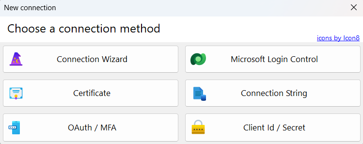

# Custom channels solution builder

This component allows you to create a Dynamics 365 solution to establish a custom channel in Customer Insights - Journeys.

To accomplish this, you must first create the C# plugin with the necessary elements for sending the message, and then create the [Custom API](https://learn.microsoft.com/en-us/dynamics365/customer-insights/journeys/real-time-marketing-custom-channel-custom-api) with its corresponding _Request_ and _Response_. Additionally, the extended configuration entities and their respective forms must be created in the traditional way and be published so that they can be selected ([See Moore](https://learn.microsoft.com/en-us/power-apps/maker/data-platform/create-edit-entities-portal?tabs=excel)).  All of this can be done from the page: [https://make.powerapps.com/](https://make.powerapps.com/).

The tool allows you to create the solution with the channel elements, this will be done based on a series of steps that I detail below:

### Step #1: Set the configuration entity:

In this section an extended configuration entity for the channel instance ([See more](https://learn.microsoft.com/en-us/dynamics365/customer-insights/journeys/real-time-marketing-define-custom-channel-instance)) is defined. To do so, this entity is chosen from the list of entities in the system, and the form to be used at the time of channel configuration is also selected. In SMS type channels this corresponds to the configuration of the channel senders.

### Step #2: Set the parts messages

In this step the message parts ([See more](https://learn.microsoft.com/en-us/dynamics365/customer-insights/journeys/real-time-marketing-custom-channel-message-parts)) are defined, for which the types of message parts that the channel will allow are added, as well as the possibility of generating display names and descriptions both in English and in an alternative language (such as Spanish).

### Step #3: Set the location information (Optional)

In this section the localization is set and therefore the channel name, its description and the special consent labels are set in 2 languages: English and an alternative language such as Spanish ([See more](https://learn.microsoft.com/en-us/dynamics365/customer-insights/journeys/real-time-marketing-custom-channel-localization-admin)) . This will help in multilingual environments so that the labels are displayed according to the language set by the user.

### Step #4: Set the message editor

In this section the message editor interface ([See more](https://learn.microsoft.com/en-us/dynamics365/customer-insights/journeys/real-time-marketing-custom-channel-message-editor)) is defined, to do so, choose from the list of entities in the system which one it would be, and select the form to be used as message editor.

### Set #5: Set the solution and channel information

This step establishes the solution to be used or generated, the type of channel (Custom or SMS) and the general data of the channel, the customized API and the functionalities that the channel allows ([See more](https://learn.microsoft.com/en-us/dynamics365/customer-insights/journeys/real-time-marketing-define-channel-definition))

### Step #6: Set the configuration form channel instance account (Only SMS)

This step will only be enabled if the Channel type is SMS and allows you to choose the entity for the configuration of the channel instance account ([See more](https://learn.microsoft.com/en-us/dynamics365/customer-insights/journeys/real-time-marketing-define-channel-instance-account)). To do so, choose the entity from the list of entities in the system and select the form to be used when configuring the channel.

### Step #7: Add additional entities to the solution

This allows us to add necessary entities as components for the solution and to avoid future problems of dependencies in future exports and imports.

We must consider that the application adds all the components selected in the previous steps to the established solution, this includes the entities, forms, relationships and custom APIs that were chosen. This case could be some additional entity as some template or catalog needed.

o complete, clicking on the ***“Create Solution”*** button with the information established in the previous steps will generate the necessary components in the solution, either the corresponding relationships or the customized channel itself. To do so, it will export the solution you created or selected, edit it and add the channel components. Then, depending on the selection:

- **_Import and publish solution:_** It will import the solution with the changes and do the necessary publishing in the environment. Once this is done the channel will appear in the list of these for custom channels and on the list of SMS providers for SMS.

- **_Copy solution zip:_** You can also copy the solution that you will generate to disk (This can be either when you publish or when you do not publish). This is so that it can later be imported by traditional means.

Likewise, at the end of the channel creation process, the ***“Export Solution”*** button will be enabled, and you will be able to export the final solution, whether it is a managed or unmanaged solution

It should be considered that these operations can be long, so it is recommended to use the ***“Client ID / Secret”*** connection option, since it allows a much longer response time. In this case we recommend a minimum of 5 minutes.

